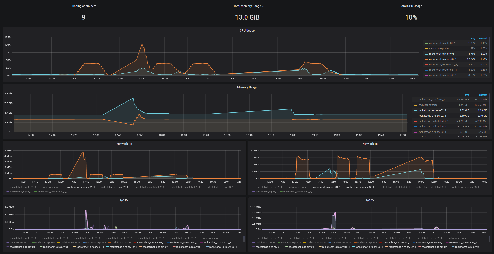
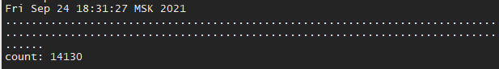
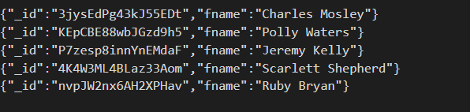

# Test results name.sh

```sh
# operation write to primary time
real    4m6.960s
user    3m26.941s
sys     0m32.433s

# script time
real    14m4.318s
user    7m19.646s
sys     1m2.912s

rs0:PRIMARY> db.rocketchat_subscription.find().count()
1191908
rs0:PRIMARY> db.rocketchat_subscription.find({t:"d"}).count()
887884
```

## Metrics

container metrics, after several startup cycles



## Output

**./log** - one point is positive step offset



**./log.tmp** - the number of lines for the update, contain _id records and fname user


